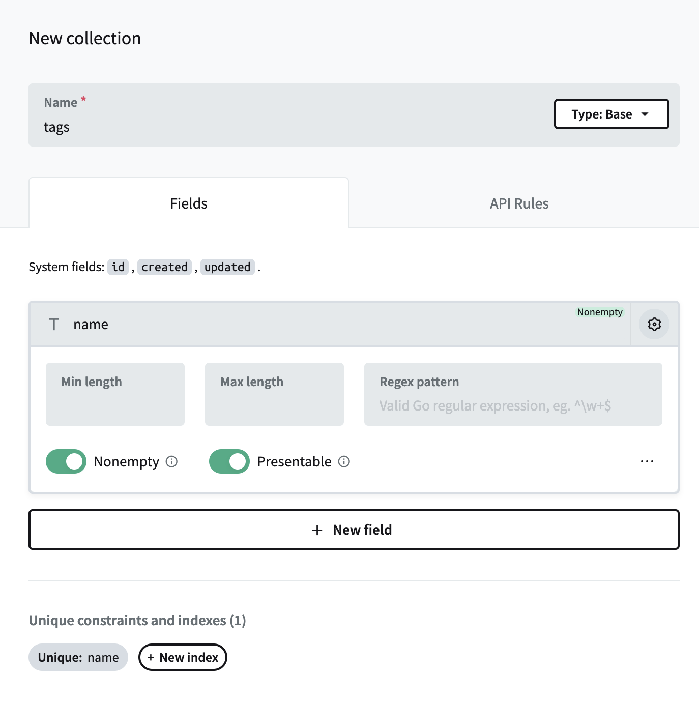
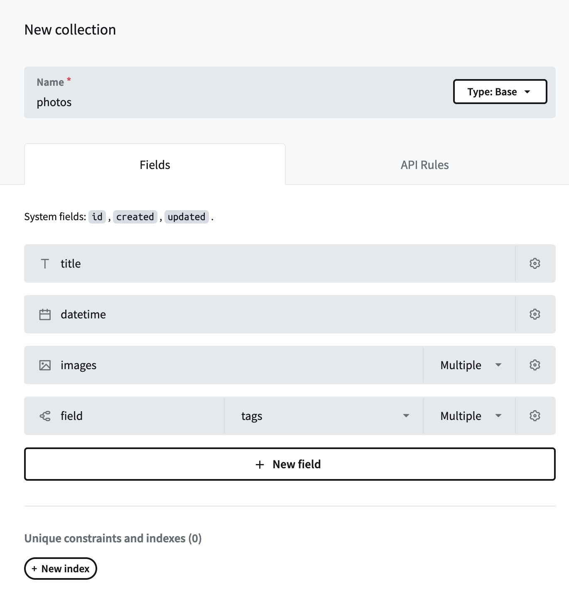

Whatthehive
===========

Simple photo sharing web app with a RESTful API, based on [PocketBase][0]

## Collections

- `tags`

- `photos`

## Custom routes

- HTML: `/:tag_id`
- JSON: `/:tag_id/json`

JSON response should work with [Whatthefoto][1] app.

[0]: https://github.com/pocketbase/pocketbase
[1]: https://github.com/manhtai/whatthefoto

---

&copy; 2024 Tai Vo
